[github.com/NizamuddinSameer-1](https://github.com/NizamuddinSameer-1) &nbsp;·&nbsp;
[nizamuddinsameer5@gmail.com](mailto:nizamuddinsameer5@gmail.com)

  

> BCA student & software developer. 
> Building autonomous AI workflows, custom media bots, and open-source tools.

I build automated engines, test them on real data, and eliminate friction. Currently scaling 
[pinterest-automation-suite](https://github.com/NizamuddinSameer-1/pinterest-automation-suite) — an autonomous visual generation and multi-account publishing 
engine with cloud GPU upscaling. Also deeply focused on agentic AI, LLM tooling, and financial models.

<samp>python &nbsp; typescript &nbsp; javascript &nbsp; react &nbsp; fastapi &nbsp; scikit-learn &nbsp; langchain &nbsp; pandas &nbsp; docker &nbsp; git &nbsp; linux</samp>

**[pinterest-automation-suite](https://github.com/NizamuddinSameer-1/pinterest-automation-suite)** &nbsp;·&nbsp; <samp>python, automation, colab</samp> 
Automated Pinterest affiliate growth engine: AI-powered visual generation, automated Colab GPU 
upscaling, multi-account publisher, and dynamic lookbook bridge.

**[AI-YouTube-Content-Planner](https://github.com/NizamuddinSameer-1/AI-YouTube-Content-Planner)** &nbsp;·&nbsp; <samp>python, llm, automation</samp> 
Autonomous content strategist and planner generating optimized hooks, video outlines, 
SEO metadata, and publication timelines.

**[AI-Stock-Market-Analysis-Chatbot](https://github.com/NizamuddinSameer-1/AI-Stock-Market-Analysis-Chatbot)** &nbsp;·&nbsp; <samp>python, financial data, llm</samp> 
Conversational market intelligence agent analyzing stock movements, technical indicators, 
and company balance sheets with interactive synthesis.

**[ChatWithPDF](https://github.com/NizamuddinSameer-1/ChatWithPDF)** &nbsp;·&nbsp; <samp>python, rag, langchain</samp> 
Context-aware document retrieval engine enabling conversational Q&A, citation extraction, 
and rapid synthesis over long-form technical documents.

**[AI_EDA_Agent](https://github.com/NizamuddinSameer-1/AI_EDA_Agent)** &nbsp;·&nbsp; <samp>python, pandas, analytics</samp> 
Autonomous agent for Exploratory Data Analysis: automated profiling, anomaly detection, 
and statistical visualization generation.

**[ML_Flower_Classification-project_NS](https://github.com/NizamuddinSameer-1/ML_Flower_Classification-project_NS)** &nbsp;·&nbsp; <samp>python, scikit-learn, streamlit</samp> 
Multi-model benchmark suite comparing 6 classifiers with a real-time interactive 
Streamlit interface for side-by-side performance evaluation.

Every graphic here is generated, not embedded from anyone else's server. 
`ascii.svg` is an ASCII portrait pushed through a character ramp with embedded 
JetBrains Mono; the stat graphics, the status HUD and these section headings are drawn by 
[a scheduled action](.github/workflows/stats.yml) straight from the GitHub GraphQL API, 
once a day, committing only what changed.

The page reads as one terminal session: a boot banner up top, a logout at the bottom 
(both drawn once by [build_static.py](scripts/build_static.py)), and each section headed by 
the command that printed it. They animate with SMIL inside the SVG, because GitHub 
strips scripts from READMEs — and since nothing loads from a third party, nothing here 
can rate-limit or go dark. The headings are SVGs for the same reason: GitHub also 
strips CSS, so an image is the only way to put this page's own typeface on them.

The typeface is [JetBrains Mono](scripts/fonts), subset to just the characters 
each graphic draws and inlined as base64. That isn't only for looks: the 
portrait's grid assumes an advance width of exactly 0.600 em, and a viewer whose 
default monospace is narrower would otherwise see it squeezed.

Language totals cover public repositories only. `year.svg` uses the portrait's 
character ramp: `:` `+` `#` `@`, quiet to loud.

